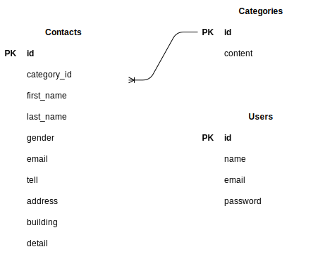

# laravel_exam
1.git@github.com:dtog0863/laravel_exam.git
2.docker-compose up -d --build

##Laravel環境開発
    1.docker-compose exec php bash
    2.composer install
    3..env.exampleファイルから.envを作成し、環境変数を変更
    4.php artisan key:generate
    5.php artisan migrate
    6.php artisan db:seed

##使用技術
　・php 8.25
　・MySQL 15.1
　・Laravel 8.83
　・composer 2.6.5

##ER図

##URL
　・開発環境:http://localhost/
　・phpMyAdmin:http://localhost:8080/

